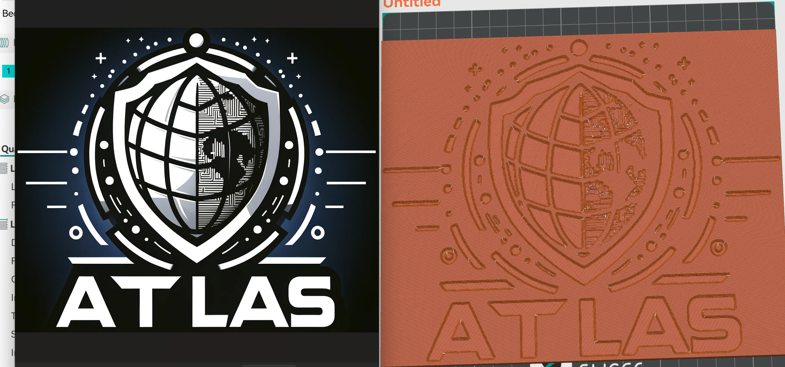

# Image to 3D STL Generator

Converts a 2D image logo into a single 3D printable STL file, baseplate and logo details combined into one mesh. Physical dimensions are baked into the geometry at export time, so the model loads into OrcaSlicer, Bambu Studio, or Cura at the exact size you set, no rescaling needed.

## Features

- Single STL output, baseplate and logo geometry combined
- Nozzle-aware filtering removes lines and details thinner than your nozzle can print
- Millimeter-accurate scaling baked into the mesh
- Raised mode: logo sits on top of the baseplate
- Etched mode: logo is carved into the plate, solid floor underneath
- Adjustable edge smoothing on vertical walls to reduce print vibration artifacts

## Requirements

```bash
pip install numpy numpy-stl opencv-python
```

## Quick start

1. Save the script locally.
2. Set your input image and output STL paths at the bottom of the script.
3. Run it:

```bash
python generator.py
```

## Configuration

All physical parameters are set inside the script call.

| Parameter | Description |
|---|---|
| `target_width_mm` | Final model width in mm, as it will import into your slicer |
| `backplate_thickness_mm` | Total thickness of the base plate, in mm |
| `logo_height_mm` | Height of raised details, or depth of etched details |
| `nozzle_diameter_mm` | Your nozzle diameter; details smaller than this are dropped automatically |
| `inverse` | `False` to etch the logo into the plate, `True` to raise it above the plate |
| `invert_logo` | `True` if the source image has a dark logo on a light background |
| `resolution_limit` | Mesh density; 450 is a good default for high detail without a large file size |
